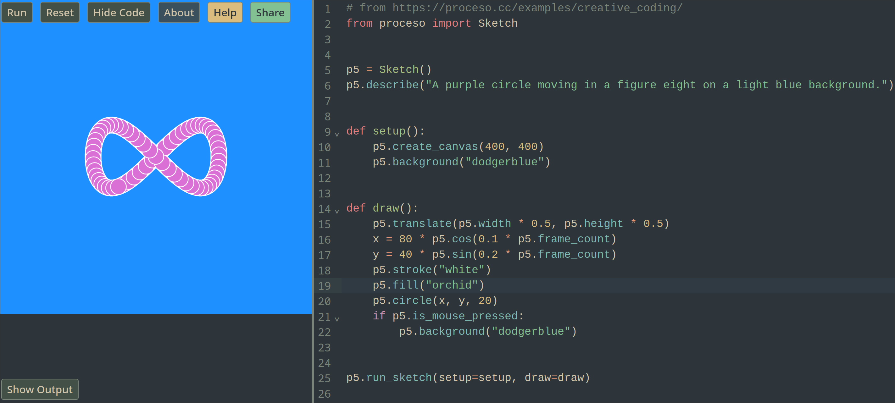

# Diver

Diver is a tool that makes it easy to create dynamic and interactive works of art with code.



- Create visual python programs in your browser
- Everything runs locally on your machine
- Easily share your works of art with others
- Actively being developed (As of Feb. 2024), If you run into anything confusing [please let me know!](https://github.com/JohnEdChristensen/diver/issues/new)

## Why
You don't need to understand what's under the hood to use Diver, but some details on how it works is useful to understand if this project is right for you.

[Can't wait to write your first line of code? Jump ahead and get started!](#basics)

### Run python anywhere
Diver runs python code directly in your browser. This means you can try it out without needing to install or set anything up! What does "in your browser" mean? It means that running your python code is just as easy as visiting a website. You can access your code on all your devices that can visit websites. Your phone, work computer, laptop, friends laptop, etc. That's convenient! 

### It's your code, on your computer
One important distinction here is that even though it runs in the browser, it's running in *your* browser, not off somewhere in the cloud. All the code is being executed locally on your computer. If you lose connection to the internet, your sketch will keep running just fine. 

Want to bring your laptop out to a cabin in the woods with no internet? You can cozy up next to the fireplace and keep playing with your code!

## Use Cases
Running Python in the browser has some really nice benefits! But It's not always the right option. Here are some good use cases for using python in the browser.

### A tool for new programmers
Learning to program is fun! Configuring your computer to be able to actually run your first line of code is less fun. It's not the worst thing in the world, but it's not be best "first time programming" experience.

Removing some of the complexity that comes along with learning a new skill is a great way to make learning that skill more accessible. It decreases the chance of people "bouncing off" learning something because they didn't quite make it over the initial frustrating learning curve.

### A tool for teachers
If you want to teach a group of students python, it could be a rough experience trying to get python, and packages, and an editor all setup on each student's computer. Having everything accessible as website means each student just needs to open a link to get started! No troubleshooting why python isn't in Jimmy's PATH.

### A tool for seasoned developers
Want to make some beautiful programmatically generated art? Try it out without needing to set anything up on your computer, and immediately share your work with others just by sending a link! You don't need to setup a server to share your art with your mom. Diver handles all that for you. (Seriously, send what you make to your mom. She'll love it)

The site is totally static. So it can be served from a static website server, meaning it is simple to embed interactive python visuals on personal websites/blogs.

It also means you can host your own version if you want. Simply fork this repository and enable github pages in the repo settings. That's it! Now you can edit the site however you want!


## Examples
- [Using proceso](https://johnedchristensen.github.io/diver/?filename=examples/proceso_figure_8.py)
- [Impossible Triangle](https://johnedchristensen.github.io/diver/?filename=examples/impossible_object.py)
- [Rainbow Wave](https://johnedchristensen.github.io/diver/?filename=examples/rainbow.py)
- [Swirling Squares](https://johnedchristensen.github.io/diver/?filename=examples/squares.py)
- [Simulated String](https://johnedchristensen.github.io/diver/?filename=examples/string.py)

## Basics
Use "Show Code" button to view/edit the code yourself!
After making changes click "Run" or use Ctrl-Enter to run your code.

[Get started](https://johnedchristensen.github.io/diver/?filename=examples/proceso_figure_8.py) with a drawing example using p5js (via proceso).
### p5.js
> p5.js is a JavaScript library for creative coding, with a focus on making coding accessible and inclusive for artists, designers, educators, beginners, and anyone else! p5.js is free and open-source because we believe software, and the tools to learn it, should be accessible to everyone.
https://p5js.org/

p5.js is a great project, but is limited to using JavaScript. Using Pyodide, python code can now run alongside JavaScript code in your browser, and use all the functionality that p5.js offers. An additional library needs to handle translations between p5.js and python, and proceso does just that!
### proceso
The [proceso](https://github.com/nickmcintyre/proceso) lets you use [p5js](https://p5js.org/) from python.
#### [Try it out](https://johnedchristensen.github.io/diver/?filename=examples/proceso_simple_shapes.py)
```python
from proceso import Sketch


p5 = Sketch()
p5.describe("A rectangle, circle, triangle, and flower drawn in pink on a gray background.")

# Create the canvas
p5.create_canvas(720, 400)
p5.background(200)

# Set colors
p5.fill(204, 101, 192, 127)
p5.stroke(127, 63, 120)

# A rectangle
p5.rect(40, 120, 120, 40)
# A circle
p5.circle(240, 240, 80)
# A triangle
p5.triangle(300, 100, 320, 100, 310, 80)

# A design for a simple flower
p5.translate(580, 200)
p5.no_stroke()
for _ in range(10):
    p5.ellipse(0, 30, 20, 80)
    p5.rotate(p5.PI / 5)
```
From proceso documentation.
Checkout more proceso examples: https://proceso.cc/examples/creative_coding/

Using the proceso examples and the documentation at https://p5js.org/ should give you everything you need to make cool things! Note that when using the p5js documentation, you'll need to convert the p5js function names from javascript's standard `camelCase` to python's `snake_case`.

Consider contributing to [proceso's documentation](https://github.com/nickmcintyre/proceso) if you'd like to help improve this!


Want to go deeper? Checkout [advanced usage](./advanced_usage.md)
